# Threadly (MVP)
<a href="https://threadlycom.vercel.app" >threadly official website<a/>
A social media app (native Android) with real-time messaging, stories, and reels — built with care, from scratch.

---

## 🚀 What is Threadly

Threadly is a feature-rich native Android social media application. It allows users to connect, share moments via posts and stories, watch reels, and chat in real-time.

### Key Features

*   **Authentication**: Secure Login & Signup (Email/Mobile) with OTP verification.
*   **Social Feed**: Dynamic home feed supporting Images, Videos, and Stories.
*   **Real-time Messaging**: 1-on-1 chat powered by **Socket.IO** with **FCM** fallback for offline delivery.
*   **Reels**: TikTok-style scrollable video feed with caching and smooth playback using **ExoPlayer**.
*   **Media Creation**: Custom camera implementation using **CameraX** for capturing stories and posts.
*   **Offline Support**: Robust local caching using **Room Database** to view content even without internet.
*   **Interactions**: Likes, Comments, Shares, and Follow/Unfollow system.

---

## 🛠 Tech Stack

The project follows modern Android development practices and the **MVVM (Model-View-ViewModel)** architecture.

*   **Language**: Java (Native Android)
*   **Architecture**: MVVM
*   **Networking**: Fast Android Networking / Retrofit
*   **Real-time Communication**: Socket.IO Client
*   **Local Database**: Room Database
*   **Image Loading**: Glide
*   **Video Playback**: ExoPlayer (Media3)
*   **Camera**: CameraX
*   **Push Notifications**: Firebase Cloud Messaging (FCM)
*   **Backend**: Node.js + Express + MySQL (Hosted separately)

---

## 📂 Project Structure

Here's a quick overview of the package structure to help you navigate the code:

```
com.rtech.threadly
├── activities          # Activity classes (Screens)
├── fragments           # Fragment classes (UI Sections)
├── adapters            # RecyclerView Adapters for lists/feeds
├── viewmodels          # ViewModel classes for UI logic
├── models              # Data models (POJOs)
├── network_managers    # API handling and repository classes
├── SocketIo            # Socket.IO connection and event handling
├── RoomDb              # Local database entities and DAOs
├── utils               # Utility classes and helpers
└── constants           # App-wide constants
```

---

## 🔍 How to Run / Setup

### Prerequisites
*   **Android Studio**: Latest version recommended.
*   **JDK**: Java 11.
*   **Android SDK**: API Level 35 (Target), API Level 29 (Min).

### Steps
1.  **Clone the repository**
    ```bash
    git clone https://github.com/rashidekbal/threadly.git
    ```
2.  **Open in Android Studio**
    *   Open the project and let Gradle sync.
3.  **Backend Setup**
    *   The app requires a running backend. Clone and setup the server: [Threadly Server](https://github.com/rashidekbal/threadlyServer)
    *   Update the `BASE_URL` in `app/build.gradle` (debug/release build types) to point to your local or hosted server.
4.  **Firebase Setup**
    *   Add your `google-services.json` file to the `app/` directory for FCM to work.
5.  **Build & Run**
    *   Connect a physical device or use an emulator to run the app.

---

## 📸 Screenshots
<div align="center">
 
</div>

<p align="center">
  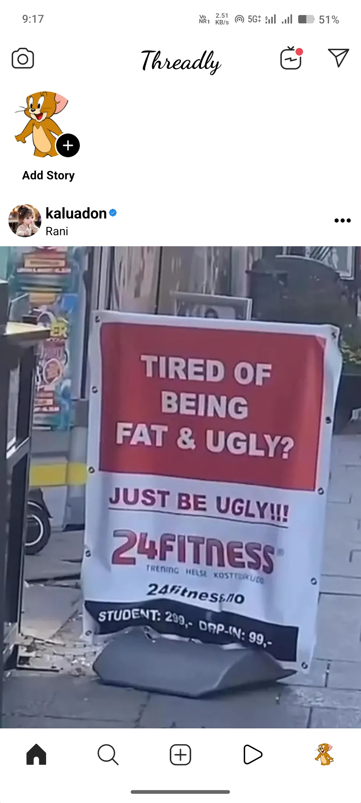
  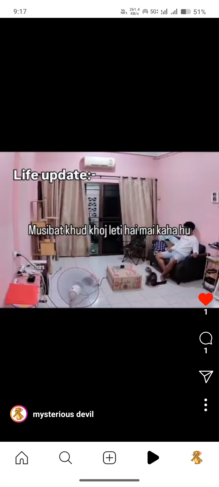
  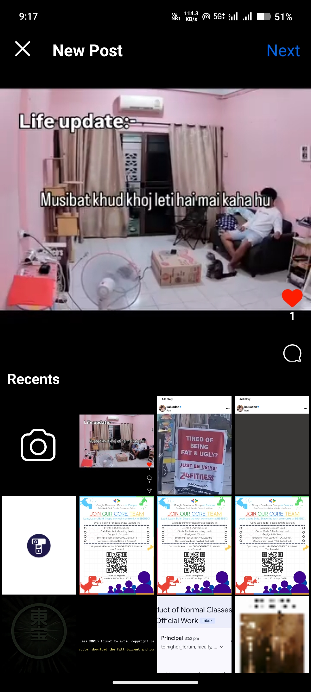
</p>

<p align="center">
  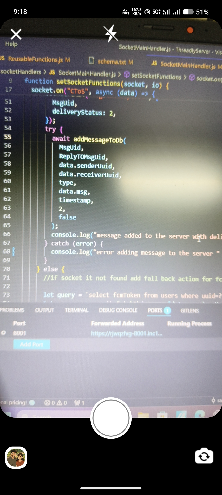
  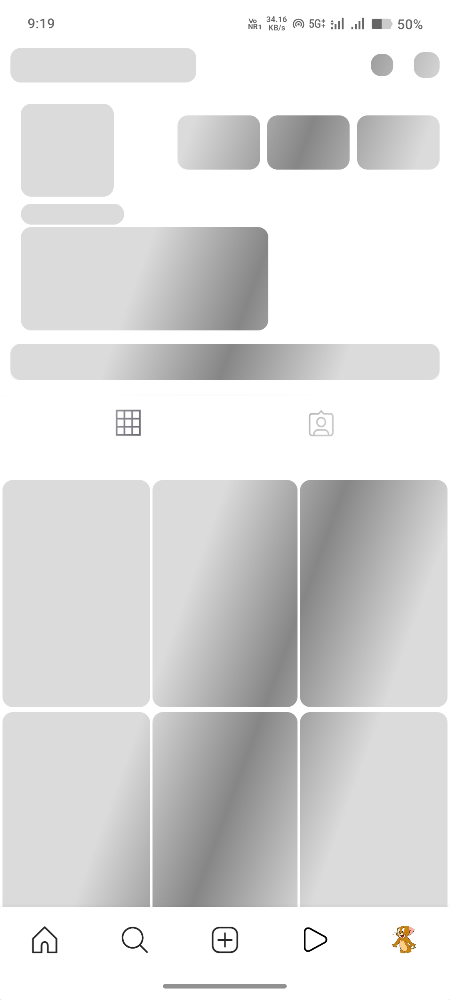
   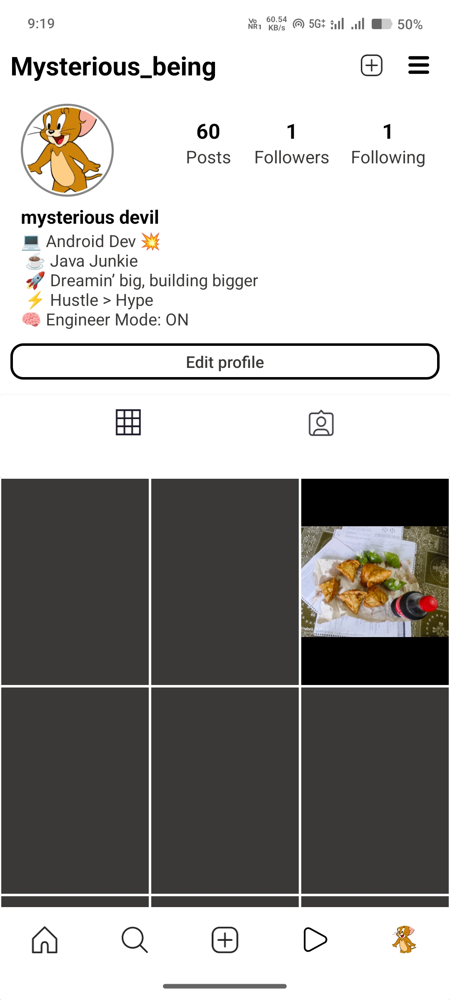
</p>

<p align="center">
  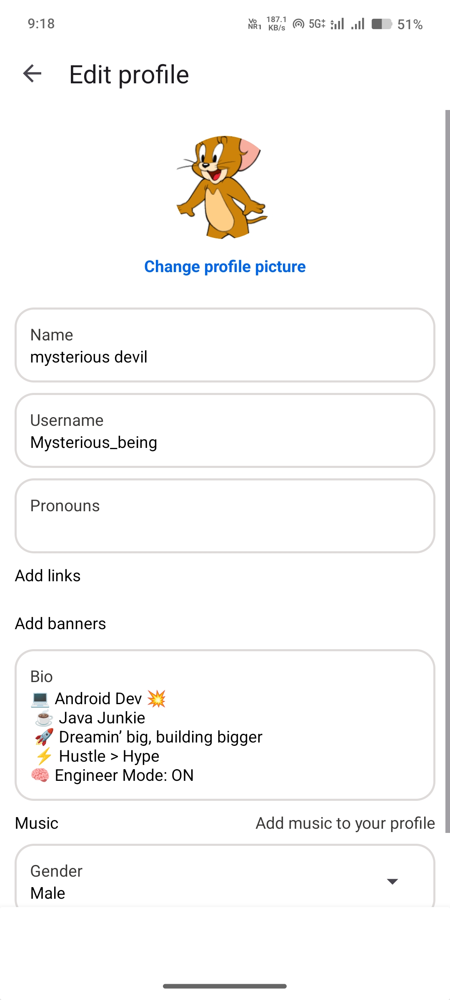
  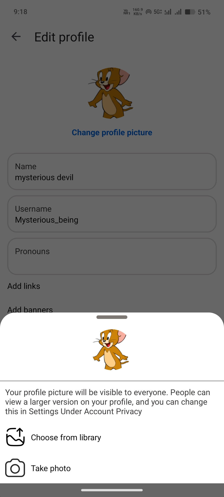
   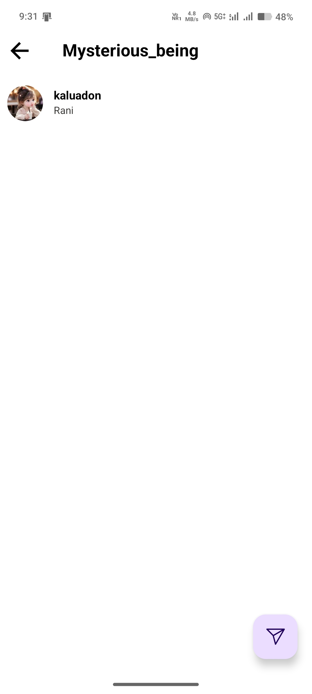
</p>

<p align="center">
  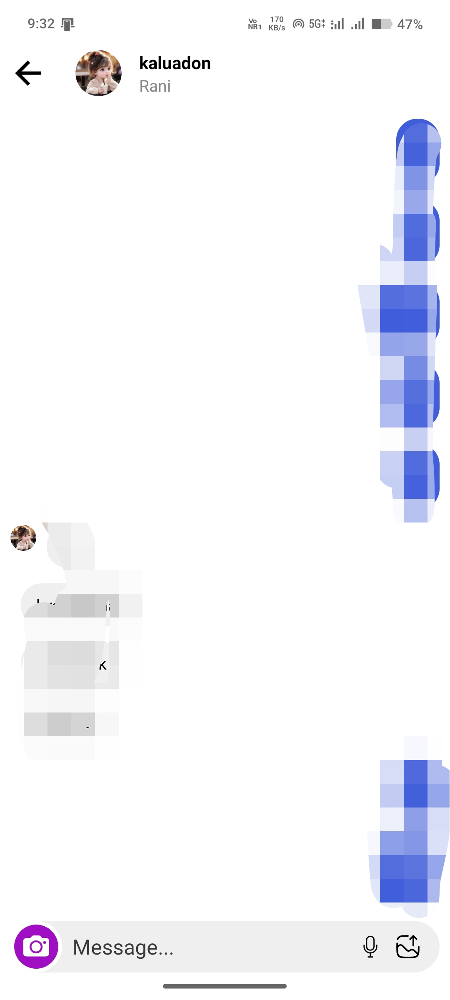
  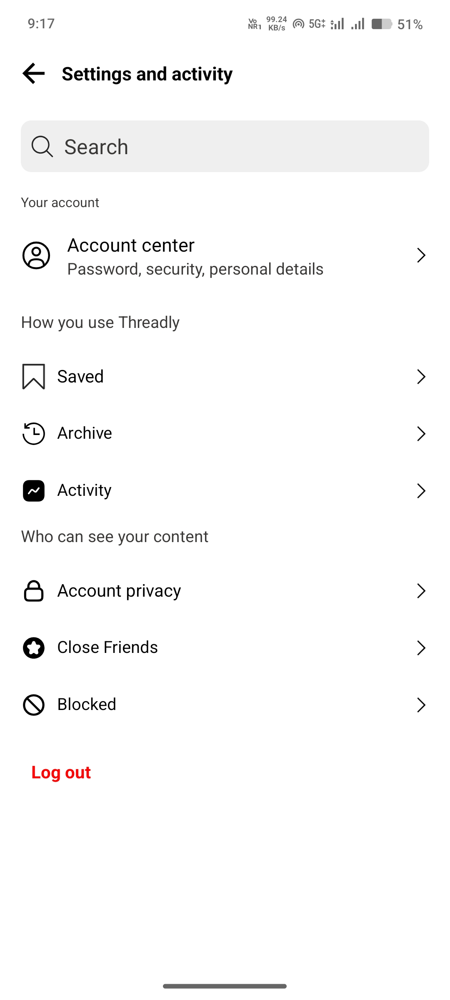
</p>

---

## 🔭 Roadmap

*   [ ] Smooth Reels UI + video caching (In Progress)
*   [ ] Robust fallback system (when Socket.IO disconnects)
*   [ ] Notifications (messages, reactions, mentions)
*   [ ] User profiles (avatars, bios)
*   [ ] Likes, comments, and social interactions
*   [ ] Privacy controls & moderation features

---

## 🙋 Contact

*   **GitHub**: [rashidekbal](https://github.com/rashidekbal)
*   **Email**: rtechdevlopment123@gmail.com
