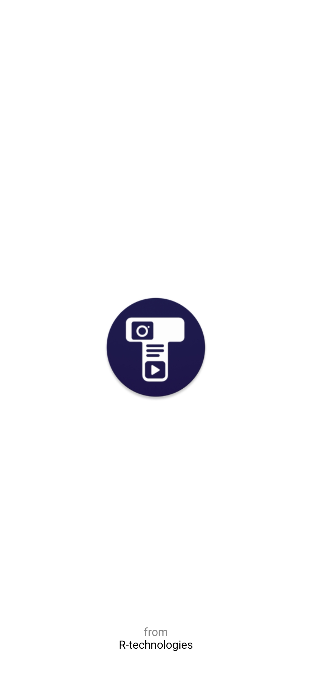

# Threadly

A social media app (native Android) with real-time messaging, stories, and reels — built with care, from scratch.

---

## 🚀 What is Threadly

Threadly is an Android social media app under development. Key features:

- Real-time messaging using **Socket.IO**, with fallback via **FCM**
- Story uploads: videos + images
- Reels section to explore what others have shared
- Backend built using **Node.js**, **Express**, **MySQL** — built from scratch
- All code (frontend + backend) is available on my GitHub

---

## 🔧 Features

| Feature                               | Status                    |
| ------------------------------------- | ------------------------- |
| User registration / login             | ✅                        |
| Real-time 1-on-1 messaging            | ✅                        |
| Fallback messaging (FCM)              | ⚠ partially / in progress |
| Uploading stories (videos & images)   | ✅                        |
| Reels section (scrollable media feed) | ⚠ needs polishing         |
| UI styling & category sorting         | ✅                        |
| Notifications                         | ⚠ work in progress        |

---
## 📸 Screenshots

Here are some screenshots of the app in action:

<p align="center">
  
  
  
</p>

<p align="center">
  
  
  
</p>

<p align="center">
  
  
  
</p>

<p align="center">
  
  
  
</p>

---
## 🛠 Tech Stack

- **Android (frontend)** – Native Java
- **Real-time communication** – Socket.IO
- **Fallback/messages push** – FCM
- **Backend** – Node.js + Express
- **Database** – MySQL

---

## 🔍 How to Run / Setup

1. Clone the repository
   ```bash
   git clone https://github.com/rashidekbal/threadly.git
   ```
2. Open the Android project in Android Studio
3. Set up your Firebase project for FCM (server key + config files)
4. Backend setup:
   ```bash
   git clone https://github.com/rashidekbal/threadlyServer
   npm install
   ```
   - Configure MySQL credentials (user, password, host, port)
   - Run migrations / schema setup
   - Start server:
     ```bash
     node index.js
     ```
5. Update endpoint URLs in the Android app (point to your backend server)
6. Build & run on device/emulator

---

## 🔭 Roadmap

- Smooth Reels UI + video caching
- Robust fallback system (when Socket.IO disconnects)
- Notifications (messages, reactions, mentions)
- User profiles (avatars, bios)
- Likes, comments, and social interactions
- Privacy controls & moderation features

---

## 📂 Contribution

Contributions are welcome!

- Open an issue for bugs or feature requests
- Create a Pull Request following the existing code style (Java + Node.js)
- Add tests where possible

---

## 🙋 Contact

- GitHub: [rashidekbal](https://github.com/rashidekbal)
- Email: _[rtechdevlopment123@gmail.com]_

---
